# PQRST Learn

> Aplicación Android nativa para la **enseñanza de cardiología** — gestión de pacientes, adquisición de ECG en tiempo real y análisis educativo de señales.


---

## Índice

- [Descripción](#descripción)
- [Capturas de pantalla](#capturas-de-pantalla)
- [Arquitectura](#arquitectura)
- [Stack tecnológico](#stack-tecnológico)
- [Requisitos funcionales](#requisitos-funcionales)
- [Aspectos técnicos relevantes](#aspectos-técnicos-relevantes)
- [Problemas encontrados y soluciones](#problemas-encontrados-y-soluciones)
- [Funciones no implementadas y mejoras futuras](#funciones-no-implementadas-y-mejoras-futuras)
- [Guía de usuario](#guía-de-usuario)
- [Preguntas frecuentes](#preguntas-frecuentes)
- [Aviso legal](#aviso-legal)

---

## Descripción

**PQRST Learn** toma su nombre de las cinco ondas características del electrocardiograma: **P, Q, R, S y T**. Es una aplicación Android pensada para estudiantes, docentes y profesionales sanitarios que deseen aprender a interpretar un ECG de forma guiada, sin reemplazar en ningún caso el criterio clínico profesional.

**Funciones principales:**

- Gestión de pacientes y consultas (CRUD completo con búsqueda)
- Adquisición de señal ECG en tiempo real desde hardware **ESP32 + AD8232** vía **Bluetooth BLE**
- Importación de registros CSV (compatible con MIT-BIH)
- Análisis automático: detección de ondas R, cálculo de BPM e intervalos RR
- Visualización interactiva con zoom y scroll (librería Vico)
- Comparación educativa de patrones cardíacos
- Generación de informes PDF exportables
- Pantallas educativas: guía de ondas PQRST y anatomía cardíaca
- Modo oscuro e internacionalización ES/EN

> ⚠️ **Aviso:** Los resultados del análisis ECG, la comparación de patrones y cualquier salida de la aplicación son exclusivamente **educativos** y NO constituyen diagnóstico clínico.

---

## Capturas de pantalla

### Login y Dashboard

<div align="center">

| | | |
|:---:|:---:|:---:|
| 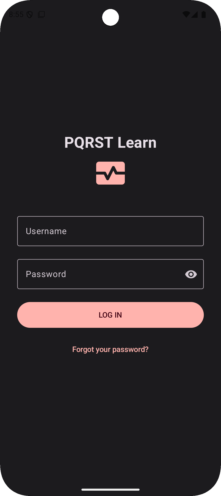 | 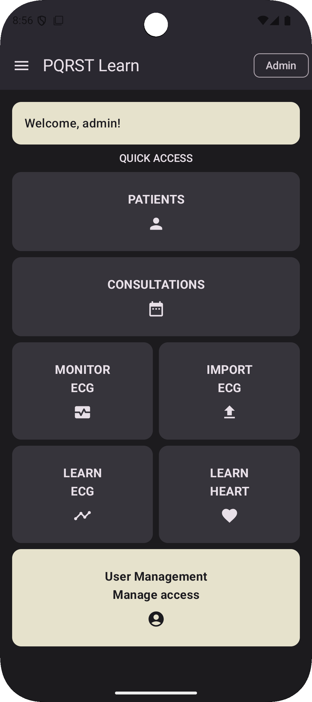 | 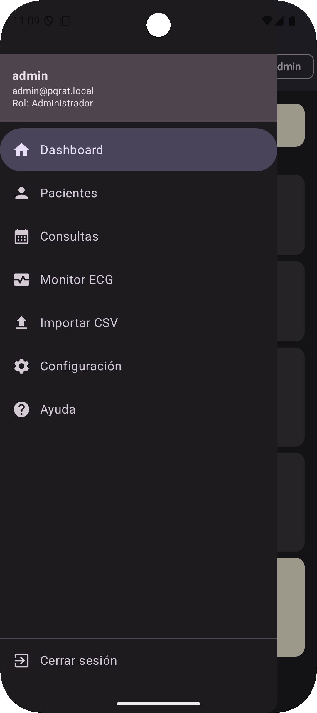 |
| Login | Dashboard | Dashboard |

</div>

### Gestión de pacientes

<div align="center">

| | | |
|:---:|:---:|:---:|
|  | 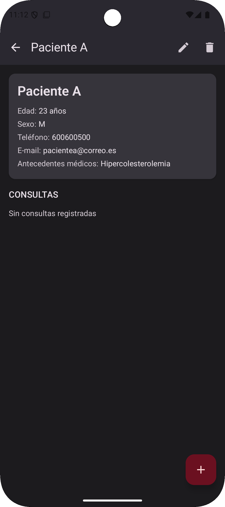 | 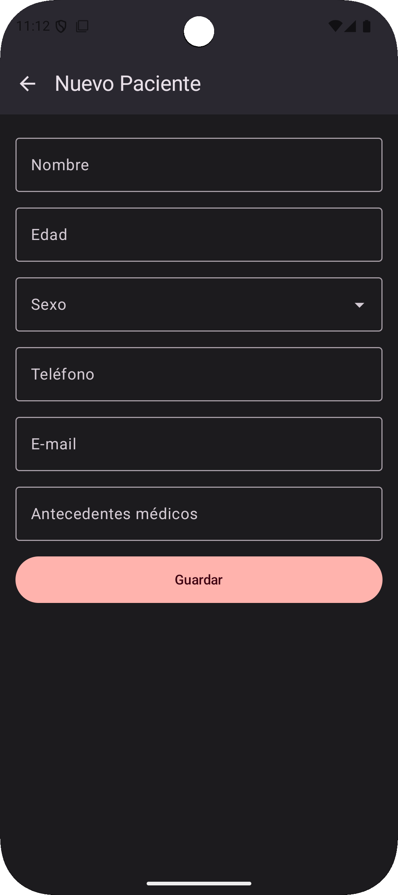 |
| Lista de pacientes | Detalle del paciente | Formulario de paciente |

</div>

### Gestión de consultas

<div align="center">

| | | | |
|:---:|:---:|:---:|:---:|
| 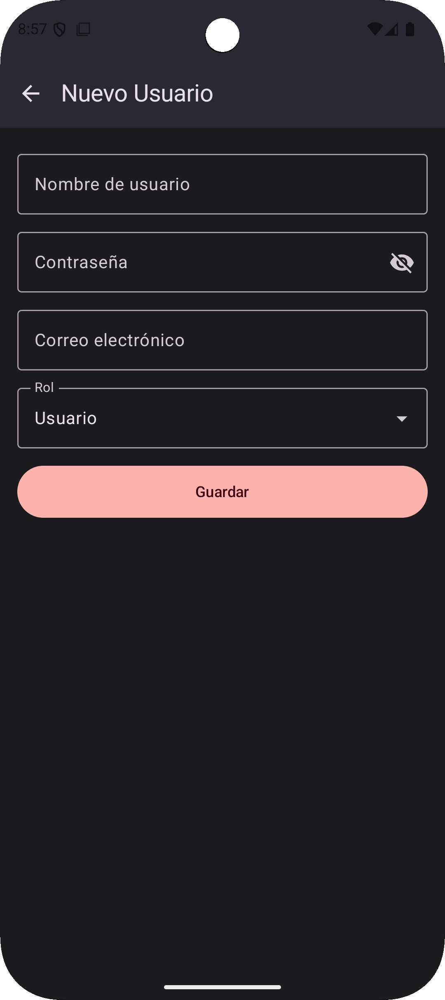 | 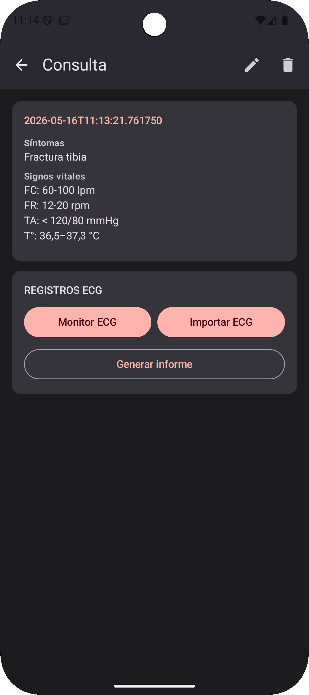 | 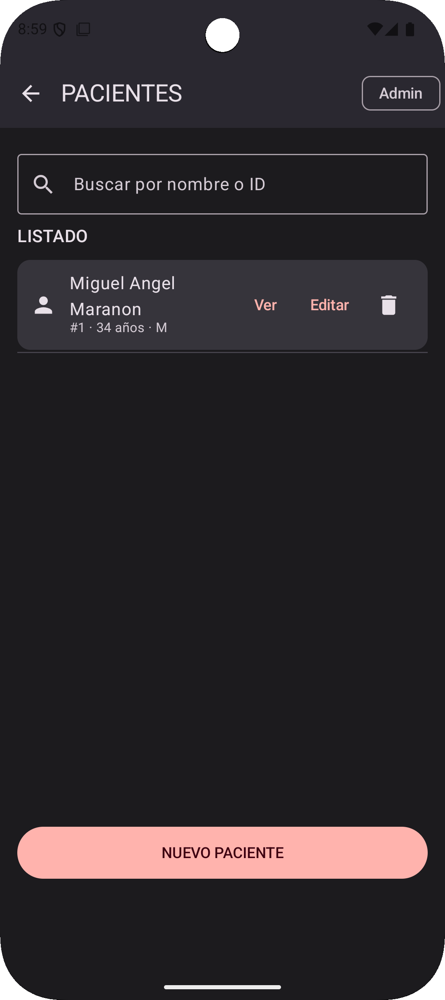 | 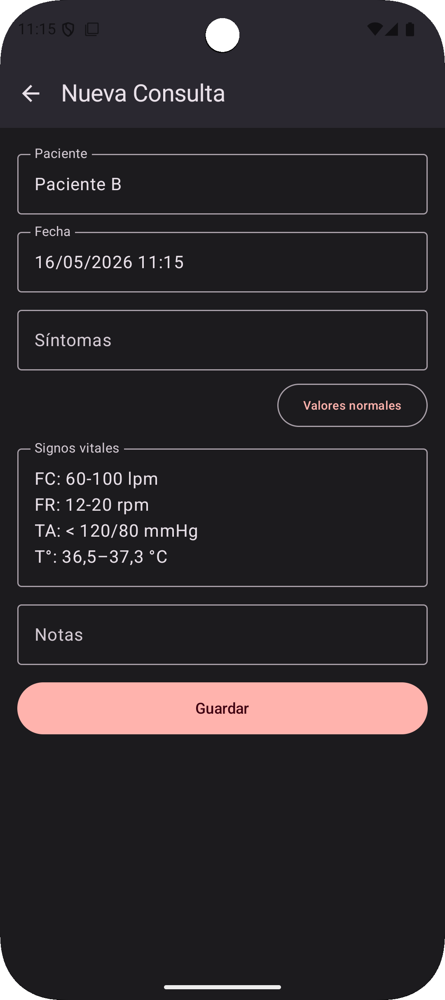 |
| Lista de consultas | Detalle de consulta | Formulario | Formulario |

</div>

### Módulo ECG

<div align="center">

| | | |
|:---:|:---:|:---:|
|  | 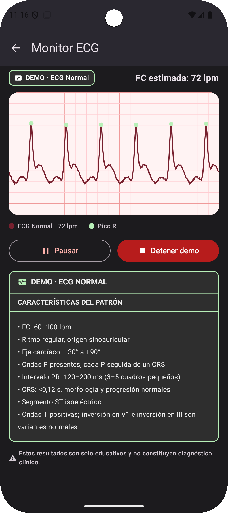 | 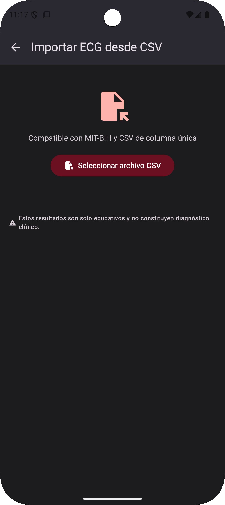 |
| Escanear ESP32 | Captura en tiempo real | Importar CSV |

| | | | |
|:---:|:---:|:---:|:---:|
| 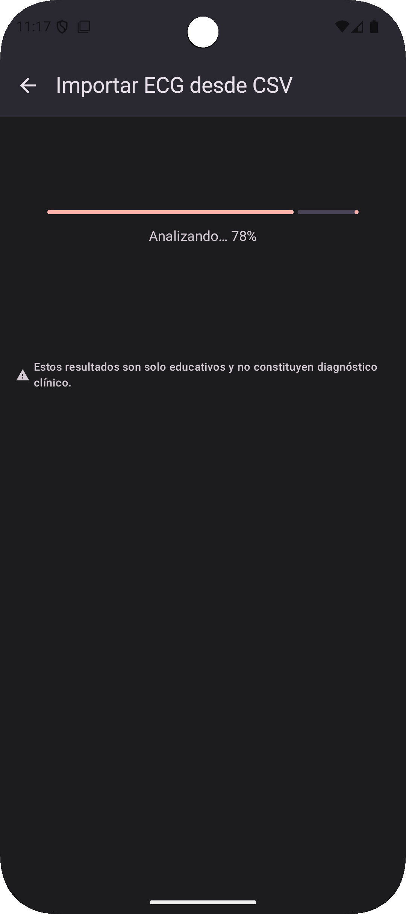 | 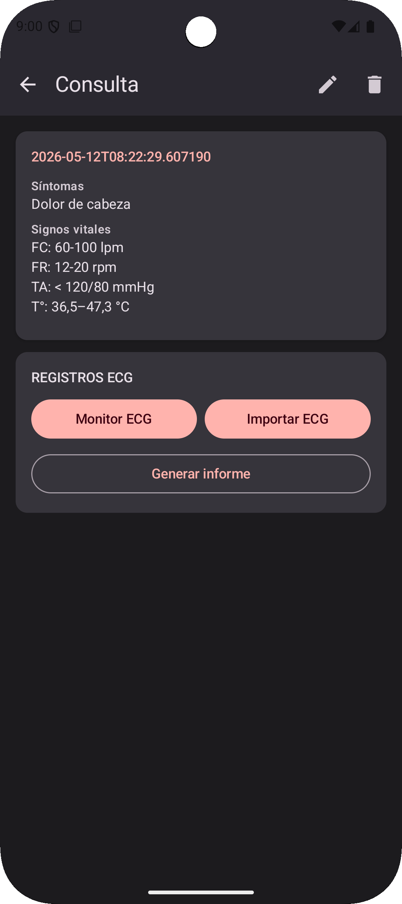 | 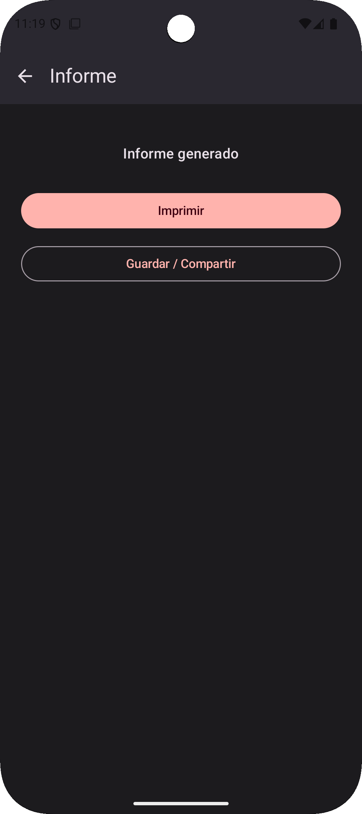 | 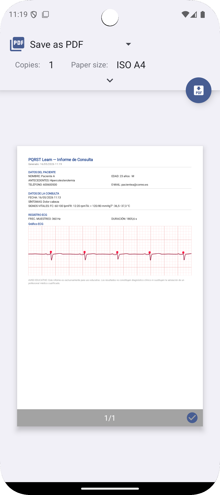 |
| Análisis ECG | Visualización de señal | Informe PDF | Informe PDF |

</div>

### Pantallas educativas y administración

<div align="center">

| | | |
|:---:|:---:|:---:|
| 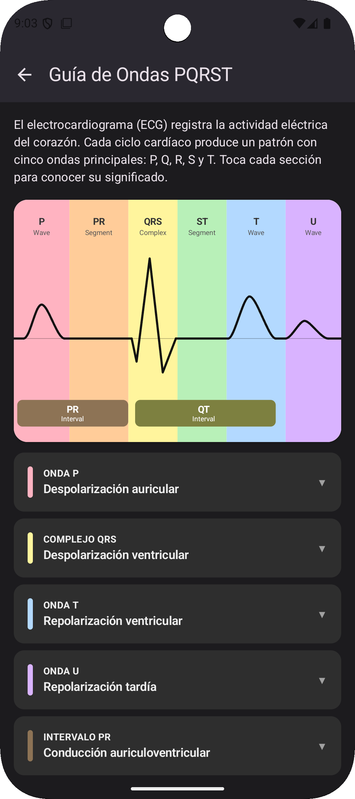 | 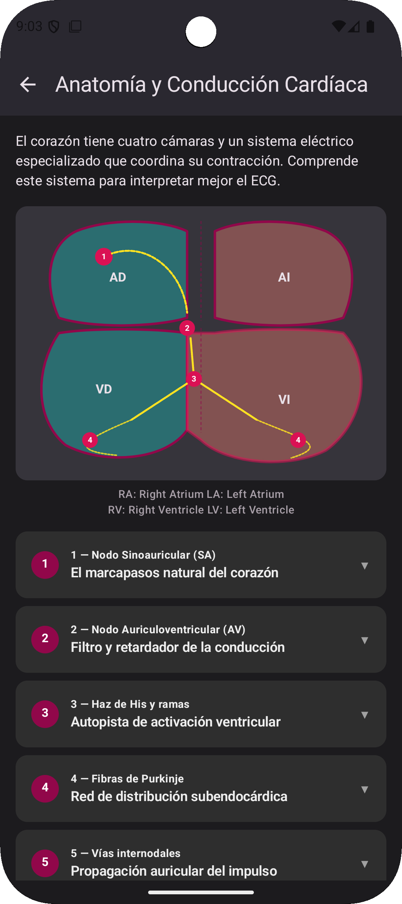 | 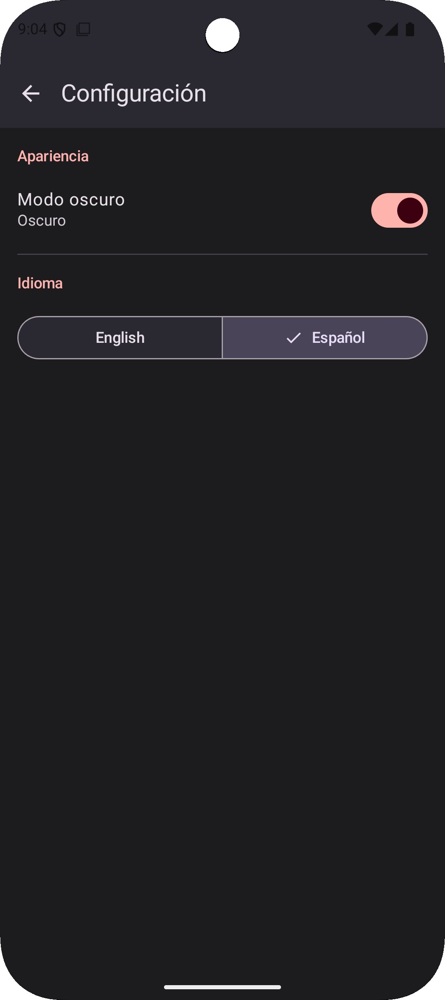 |
| Guía PQRST | Anatomía cardíaca | Configuración |

| | |
|:---:|:---:|
| 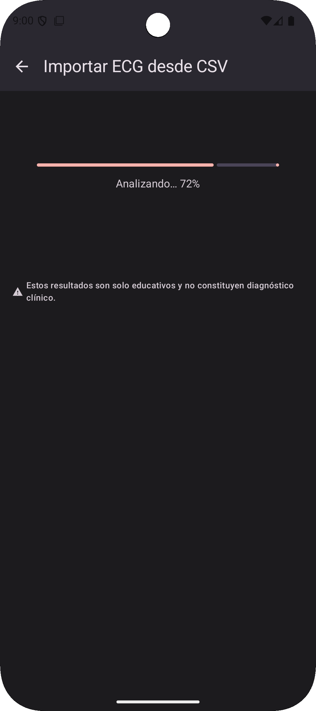 | 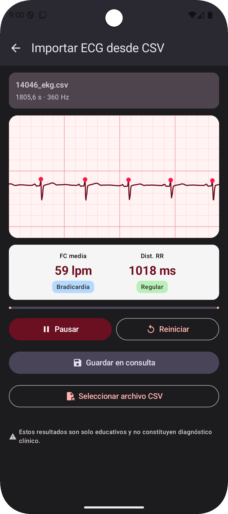 |
| Lista de usuarios | Formulario de usuario |

</div>

---

## Arquitectura

El proyecto sigue **Clean Architecture** con separación estricta en tres capas:

```
app/
├── data/           # Room DB · Bluetooth BLE/GATT · CSV parser · repositorios impl.
├── domain/         # Entidades · casos de uso · interfaces de repositorios
└── presentation/   # Pantallas Compose · ViewModels (Hilt) · navegación tipada
```

**Regla fundamental:** el módulo `domain` no importa nada de `data` ni de `presentation`. La lógica de negocio es independiente del framework y completamente testeable de forma aislada.

### Inyección de dependencias

Se usa **Hilt** con tres módulos principales:

| Módulo Hilt | Contenido |
|---|---|
| `DatabaseModule` | Provee `AppDatabase` y todos los DAOs de Room |
| `RepositoryModule` | Bindea interfaces de repositorio con sus implementaciones |
| `DispatcherModule` | Qualificador `@IoDispatcher` para separar contextos de coroutine |

### Estado y navegación

- **Estado reactivo** con `StateFlow` / `MutableStateFlow` en todos los ViewModels. Se evita `LiveData` en código nuevo.
- **Eventos de un único disparo** (errores de Snackbar) gestionados con `Channel<String>`.
- **Navegación** con Navigation Compose usando rutas tipadas (objetos Kotlin serializables), eliminando errores en tiempo de compilación.

---

## Stack tecnológico

| Módulo | Tecnología | Motivo |
|--------|-----------|--------|
| Lenguaje | Kotlin | — |
| UI | Jetpack Compose + Material Design 3 | Declarativo, moderno, mantenible |
| Gráfica ECG | Vico 2.x | Única librería Compose-native para charts de línea |
| Base de datos | Room (SQLite) | ORM oficial Android, integración nativa con coroutines |
| Inyección DI | Hilt | Estándar Android, reduce boilerplate de Dagger 2 |
| Bluetooth | BLE GATT + Nordic UART Service | El ESP32 físico usa BLE, no SPP clásico |
| PDF | `android.graphics.pdf.PdfDocument` | API integrada, sin licencias externas (evita AGPL de iText) |
| Sesión | DataStore Preferences | Reemplaza SharedPreferences con soporte coroutines |
| Hashing | `at.favre.lib:bcrypt` | Estándar de facto para almacenamiento seguro de contraseñas |
| Min SDK | Android 8.0 (API 26) | Cobertura amplia del parque de dispositivos |

### Esquema de base de datos

El esquema final consta de **8 tablas** (el diseño inicial contemplaba 5):

```sql
usuarios            (id, username UNIQUE, password_hash, role)
patients            (id, name, age, sex, medical_history, contact)
consultations       (id, patient_id FK, date, symptoms, vital_signs, notes)
ecg_records         (id, consultation_id FK, file_path, source,
                     sample_rate_hz, duration_seconds, created_at)
ecg_analysis        (id, ecg_record_id FK, heart_rate_bpm, r_peak_count,
                     rr_mean_ms, rr_min_ms, rr_max_ms, regularity,
                     algorithm_version, analysis_notes, created_at)
ecg_patterns        (id, name, description, category, csv_asset_path)
pattern_comparisons (id, ecg_record_id FK, pattern_id FK, similarity_score)
reports             (id, consultation_id FK, ecg_record_id FK,
                     file_path, generated_at)
```

Las tablas `ecg_patterns`, `pattern_comparisons` y `reports` cubren la comparación de patrones educativos (RF-07) y el historial de informes (RF-08).

---

## Requisitos funcionales

| RF | Descripción |
|----|-------------|
| RF-01 | CRUD de pacientes con búsqueda por nombre, validación inline y borrado en cascada |
| RF-02 | CRUD de consultas asociadas a un paciente |
| RF-03 | Adquisición ECG en tiempo real vía Bluetooth BLE (≥ 100 muestras/s) |
| RF-04 | Importación de señales ECG desde CSV (formato MIT-BIH compatible) |
| RF-05 | Visualización interactiva de la señal (Vico, zoom, scroll) |
| RF-06 | Análisis automático: filtrado, detección de ondas R, BPM, regularidad |
| RF-07 | Comparación educativa de patrones cardíacos con puntuación de similitud |
| RF-08 | Generación de informes PDF exportables |
| RF-09 | Autenticación con sesión persistente y dos roles |
| RF-10 | Gestión de usuarios (solo ADMIN): crear, editar, eliminar |

### Roles

| Rol | Acceso |
|-----|--------|
| `USER` | Todas las funciones clínicas y educativas |
| `ADMIN` | Todo lo de USER + panel de gestión de usuarios |

Las contraseñas se almacenan con **hash bcrypt** y nunca en texto plano.

---

## Aspectos técnicos relevantes

### Migración de Bluetooth SPP a BLE

El diseño original especificaba Bluetooth Classic (RFCOMM/SPP). Al probar con el hardware real se comprobó que el módulo BLE del ESP32 no acepta conexiones SPP. Se realizó una migración completa al stack BLE/GATT:

**Antes (SPP):**
```kotlin
val socket = device.createRfcommSocketToServiceRecord(SPP_UUID)
socket.connect()
val inputStream = socket.inputStream
```

**Después (BLE/GATT + Nordic UART Service):**
```kotlin
gatt = device.connectGatt(context, false, gattCallback, TRANSPORT_LE)
// onServicesDiscovered → localizar servicio NUS + característica TX
// Escribir ENABLE_NOTIFICATION_VALUE en el descriptor CCCD
// onCharacteristicChanged → recibir bytes de la señal
```

El protocolo es **Nordic UART Service (NUS)**, el estándar de facto para UART sobre BLE:

| Elemento | UUID |
|----------|------|
| Service | `6E400001-B5A3-F393-E0A9-E50E24DCCA9E` |
| TX Characteristic (ESP32→móvil) | `6E400003-B5A3-F393-E0A9-E50E24DCCA9E` |
| CCCD | `00002902-0000-1000-8000-00805F9B34FB` |

El ESP32 envía muestras ASCII (`"2048\n"`, valores 0–4095 del ADC de 12 bits). La app las normaliza a `[-1, 1]` con `(raw / 2048f) - 1f`.

> **Detalle:** BLE puede fragmentar una línea ASCII en varios paquetes (MTU por defecto ~20 bytes). Se usa un `StringBuilder` acumulativo (`bleLineBuffer`) que sólo extrae líneas completas (terminadas en `\n`) para parsear.

### Algoritmo de detección de ondas R

En lugar del algoritmo Pan–Tompkins completo, se implementó un **detector por umbral adaptativo** suficiente para el contexto educativo:

```
threshold = mean(signal) + 0.45 × (max(signal) − mean(signal))
R-peak   = muestra local máxima > threshold con distancia mínima de 250 ms
```

A partir de los R-peaks se calculan:
- **Intervalos RR** (distancia entre picos consecutivos en ms)
- **BPM** = `60000 / RR_medio`
- **Regularidad** mediante coeficiente de variación → `Regular` / `Irregular` / `No determinado`

Si la señal es demasiado ruidosa, el algoritmo retorna `"No determinado"` y muestra un aviso al usuario en lugar de generar resultados incorrectos.

### Generación de PDF sin librerías externas

Se usa `android.graphics.pdf.PdfDocument` (disponible desde Android 5.0) en lugar de iText, evitando su licencia AGPL y reduciendo el tamaño del APK. El informe se construye dibujando sobre un `Canvas` de `PdfDocument.Page` y renderizando la gráfica ECG como un `Bitmap` exportado del `VicoChart`.

### Doble compatibilidad de API para BLE (Android 13+)

Android 13 (API 33) deprecó `onCharacteristicChanged(gatt, characteristic)`. Para cubrir minSdk 26 se implementan ambas variantes:

```kotlin
// API 33+
@RequiresApi(Build.VERSION_CODES.TIRAMISU)
override fun onCharacteristicChanged(
    gatt: BluetoothGatt,
    characteristic: BluetoothGattCharacteristic,
    value: ByteArray,
) { parseBleEcgData(value) }

// API < 33
@Suppress("DEPRECATION")
override fun onCharacteristicChanged(
    gatt: BluetoothGatt,
    characteristic: BluetoothGattCharacteristic,
) { parseBleEcgData(characteristic.value ?: return) }
```

### Señales ECG sintéticas de demostración

Para probar el análisis sin hardware se incluye un generador de señales ECG basado en suma de gaussianas con cinco patrones predefinidos:

| Patrón | BPM | Característica |
|--------|-----|----------------|
| `NORMAL` | 72 | Ritmo regular, morfología típica |
| `TACHYCARDIA` | 120 | Intervalos RR cortos, ritmo regular |
| `BRADYCARDIA` | 45 | Intervalos RR largos, ritmo regular |
| `ATRIAL_FIBRILLATION` | ~90 | Intervalos RR variables, sin onda P clara |
| `VENTRICULAR_FIBRILLATION` | — | Señal caótica de alta amplitud |

---

## Problemas encontrados y soluciones

<details>
<summary><strong>Problema 1 — Bluetooth SPP incompatible con ESP32 BLE</strong></summary>

**Descripción:** El ESP32 físico usa el stack BLE nativo del SoC. La implementación inicial con `BluetoothSocket` RFCOMM no conseguía establecer conexión.

**Solución:** Migración completa a BLE GATT con Nordic UART Service (ver sección anterior).

**Impacto:** Reescritura de `EcgMonitorViewModel.kt` (~200 líneas). Sin cambios en `domain` ni en la UI.

</details>

<details>
<summary><strong>Problema 2 — Live Edit de Android Studio no parcheaba coroutines</strong></summary>

**Error:**
```
LiveEdit: Error instantiating superclass
java.lang.InstantiationException: Can't instantiate abstract class ContinuationImpl
```

**Causa:** Android Studio Live Edit no puede parchear lambdas de coroutines porque generan subclases de `ContinuationImpl`, que es abstracta.

**Solución:** Usar siempre **Stop + Run** (redespliegue completo) cuando se modifiquen coroutines. Live Edit solo es seguro en composables puros sin estado de coroutine.

</details>

<details>
<summary><strong>Problema 3 — Error de compilación: <code>return</code> en cuerpo de expresión</strong></summary>

**Error del compilador Kotlin:**
```
Returns are prohibited for functions with an expression body. Use block body '{...}'
```

**Causa:** Uso de `return` dentro de una función con cuerpo de expresión (`= expr`):
```kotlin
// ❌ Incorrecto
override fun onCharacteristicChanged(...) =
    parseBleEcgData(characteristic.value ?: return)
```

**Solución:**
```kotlin
// ✅ Correcto
override fun onCharacteristicChanged(...) {
    parseBleEcgData(characteristic.value ?: return)
}
```

</details>

<details>
<summary><strong>Problema 4 — Fragmentación de líneas ASCII en paquetes BLE</strong></summary>

**Descripción:** BLE limita el tamaño de un paquete de notificación a ~20 bytes (MTU por defecto). Una línea ASCII como `"2048\n"` puede llegar partida entre dos notificaciones consecutivas, causando errores de parseo.

**Solución:** `StringBuilder` acumulativo (`bleLineBuffer`) que concatena todos los bytes recibidos y sólo extrae líneas completas (terminadas en `\n`) para parsear. El fragmento incompleto queda en el buffer hasta el siguiente paquete.

</details>

<details>
<summary><strong>Problema 5 — API <code>onCharacteristicChanged</code> deprecada en Android 13</strong></summary>

**Descripción:** La firma de un parámetro se marcó como `@Deprecated` en API 33, con una nueva versión que recibe `value: ByteArray` directamente. Usar sólo la nueva firma rompía la app en dispositivos con Android < 13.

**Solución:** Implementar ambas sobreescrituras con `@RequiresApi` y `@Suppress("DEPRECATION")` (ver sección de aspectos técnicos).

</details>

<details>
<summary><strong>Problema 6 — iText AGPL no compatible con el proyecto educativo</strong></summary>

**Descripción:** iText 7 usa licencia AGPL, que exige publicar el código fuente o pagar licencia comercial.

**Solución:** `android.graphics.pdf.PdfDocument` desde Android 5.0. El renderizado manual sobre `Canvas` es más verboso pero completamente libre.

</details>

<details>
<summary><strong>Problema 7 — Vico API inestable entre versiones alpha</strong></summary>

**Descripción:** La librería Vico cambió su API pública entre versiones alpha. El patrón documentado en guías online (`LineFill`, `AreaFill`, `rememberLine`) ya no existía en la versión `2.0.0-alpha.22`.

**Solución:** Leer directamente el código fuente y los ejemplos del repositorio oficial de Vico en lugar de guías de terceros.

</details>

<details>
<summary><strong>Problema 8 — Diseño inicial de BD insuficiente</strong></summary>

**Descripción:** El diseño inicial de 5 tablas no cubría la comparación de patrones (RF-07) ni el historial de informes (RF-08).

**Solución:** Ampliar a 8 tablas añadiendo `ecg_patterns`, `pattern_comparisons` y `reports`, con las correspondientes **migraciones Room** para no perder datos en actualizaciones.

</details>

---

## Funciones no implementadas y mejoras futuras

### No implementadas en esta versión

| Función | RF | Motivo |
|---------|----|--------|
| Algoritmo de similitud en comparación de patrones | RF-07 | La infraestructura (tablas `ecg_patterns`, `pattern_comparisons`) está creada, pero DTW/correlación cruzada no se implementó por limitaciones de tiempo |
| Intent de compartir el PDF | RF-08 | La generación del PDF está completa; el `Intent.ACTION_SEND` desde la pantalla de previsualización no se completó |
| Zoom táctil en el monitor ECG en vivo | RF-05 | La señal histórica sí tiene zoom con Vico; el monitor en vivo usa ventana deslizante fija |
| Onboarding en primer arranque | — | Sustituido por las pantallas permanentes de guía educativa del dashboard |

### Hoja de ruta

**Técnico:**
- Algoritmo **Pan–Tompkins** completo para mayor robustez en señales ruidosas
- Sustituir `PdfDocument` manual por **Jetpack PDF Generator** (Android 15)
- Tests unitarios para `AnalyzeEcgSignalUseCase` con señales sintéticas conocidas
- **Room backup/restore** para exportar el historial completo

**Funcional:**
- Comparación de patrones con **DTW (Dynamic Time Warping)**
- **Anotaciones manuales** sobre el gráfico ECG
- Exportación a **formato EDF** (European Data Format, estándar clínico)
- Soporte para múltiples derivaciones (actualmente solo derivación I)
- **Sincronización en la nube** opcional con cifrado end-to-end (opt-in)

**UX:**
- Onboarding interactivo con tooltips sobre cada pantalla
- Gráfico de tendencia histórica de BPM por paciente
- Widget en la pantalla de inicio de Android

---

## Guía de usuario

### Inicio de sesión

La app arranca con una pantalla de login. Credenciales de demo:

| Usuario | Contraseña | Rol |
|---------|-----------|-----|
| `admin` | `Admin1234` | ADMIN |
| `user` | `User1234` | USER |

> Cambia las contraseñas por defecto tras el primer acceso desde *Gestión de usuarios → editar usuario*.

La sesión se mantiene activa hasta que pulsas **Cerrar sesión** en el menú lateral.

---

### Panel principal (Dashboard)

Desde el dashboard tienes acceso directo a todas las funciones:

| Tarjeta | Función |
|---------|---------|
| **Pacientes** | Gestionar el listado de pacientes |
| **Consultas** | Ver todas las consultas |
| **Monitor ECG** | Conectar el ESP32 y capturar señal |
| **Importar ECG** | Cargar un CSV desde el dispositivo |
| **Aprender ECG** | Guía interactiva de ondas PQRST |
| **Aprender Corazón** | Anatomía y sistema de conducción |
| **Gestión de usuarios** | *(solo ADMIN)* Crear y editar cuentas |

---

### Gestión de pacientes (RF-01)

1. En la lista de pacientes usa la **barra de búsqueda** para filtrar por nombre.
2. Pulsa **+** para crear un nuevo paciente.
3. Campos obligatorios: nombre, edad, sexo, historia clínica. El contacto es opcional.
4. Si falta algún campo obligatorio, la app muestra un error inline y no guarda.
5. El borrado muestra un **diálogo de confirmación** y elimina en cascada consultas y ECG asociados.

---

### Gestión de consultas (RF-02)

Cada consulta está vinculada a un paciente. Campos: fecha (por defecto timestamp actual), síntomas, constantes vitales y notas. Accesible desde el detalle del paciente o desde el menú principal.

---

### Captura de ECG con Bluetooth BLE (RF-03)

1. Asegúrate de que el **ESP32 está encendido** y el sensor AD8232 conectado.
2. Activa el **Bluetooth** del teléfono.
3. En la pantalla Monitor ECG, pulsa **Escanear dispositivos** (la búsqueda dura 10 s).
4. Selecciona tu ESP32 de la lista.
5. Pulsa **Iniciar captura** — la señal aparece en la gráfica en tiempo real.
6. Pulsa **Detener** — el buffer se guarda como CSV y se vincula a la consulta activa.

> **Permisos:** En Android < 12 se requiere `ACCESS_FINE_LOCATION` para escanear BLE (no se usa GPS). En Android 12+ este permiso ya no es necesario.

> **Sin hardware:** Puedes importar CSV de demo o usar las señales sintéticas integradas.

---

### Importar ECG desde CSV (RF-04)

- **Formato:** una o dos columnas (tiempo, amplitud), una muestra por línea, separador coma o punto y coma.
- Compatible con registros **MIT-BIH** exportados en CSV.
- Si el formato no es válido se muestra un error y no se importa el archivo.

---

### Análisis automático de ECG (RF-06)

Desde el detalle de la consulta, toca un registro ECG y pulsa **Analizar**. La pantalla muestra:

| Indicador | Descripción |
|-----------|-------------|
| Ritmo | 🟢 Normal · 🔵 Bradicardia · 🔴 Taquicardia · 🟠 Irregular · ⚪ No determinado |
| Frecuencia cardíaca | BPM estimado |
| Picos R | Número de ondas R detectadas |
| RR medio / min / max | Intervalos en ms |
| Versión del algoritmo | Campo auditable |

---

### Generación de informe PDF (RF-08)

Desde el detalle de la consulta, pulsa **Informe**. El PDF incluye datos del paciente, resumen de la consulta, imagen del ECG, parámetros del análisis y resultado de comparación de patrones. Se comparte vía **Android Share Sheet** (correo, Drive, impresión…).

---

### Pantallas educativas

- **Aprender ECG:** guía interactiva de las ondas P, QRS, T, U e intervalos PR/QT. Cada sección es un `ExpandableCard`.
- **Aprender Corazón:** diagrama del corazón con las 4 cámaras y los 5 pasos del sistema de conducción (nodo SA → nodo AV → Haz de His → ramas → fibras de Purkinje).

---

### Configuración

Accede desde el menú lateral → **Configuración**:

- **Modo oscuro:** cambio inmediato, sin reinicio.
- **Idioma:** Español / English, sin reinicio.

Las preferencias se persisten entre sesiones con DataStore.

---

## Preguntas frecuentes

**¿La app necesita conexión a internet?**
No. PQRST Learn es 100% offline. No realiza ninguna llamada a servicios externos.

**¿Puedo usarla sin el hardware ESP32?**
Sí. Puedes importar archivos CSV desde el dispositivo o usar las señales sintéticas integradas para probar el análisis.

**¿Qué formato deben tener los archivos CSV?**
Una columna de valores de amplitud (enteros o decimales), una muestra por línea. Si el archivo tiene dos columnas, se asume que la primera es el tiempo. El separador puede ser coma o punto y coma.

**¿Por qué la app pide permiso de ubicación para Bluetooth?**
En Android < 12 el sistema requiere `ACCESS_FINE_LOCATION` para escanear dispositivos BLE. No se usa la ubicación GPS en ningún momento. En Android 12+ este permiso ya no es necesario.

**¿El análisis ECG es un diagnóstico médico?**
No. PQRST Learn es una herramienta educativa. Los resultados son estimaciones algorítmicas con fines pedagógicos. Para cualquier decisión clínica, consulta a un profesional sanitario cualificado.

**¿Cómo cambio mi contraseña?**
Un administrador debe editar tu usuario desde *Gestión de usuarios → editar → nueva contraseña*.

**¿La app funciona en tablets?**
Funciona pero el layout no está optimizado para pantallas grandes. El soporte adaptativo para tablets está en la hoja de ruta.

**¿Qué versión de Android necesito?**
Android 8.0 (API 26) o superior. Probada en Android 13 y Android 14.

---

## Aviso legal

> Los resultados del análisis ECG, la comparación de patrones y cualquier salida de esta aplicación son exclusivamente **educativos** y **no constituyen diagnóstico clínico**. Para cualquier decisión sobre salud, consulta siempre a un profesional sanitario cualificado.
>
> Todos los datos de los pacientes permanecen en el dispositivo. La aplicación no realiza llamadas de red para datos de salud.

---

*PQRST Learn — Mayo 2026 · Miguel Ángel Marañón Buendía*
